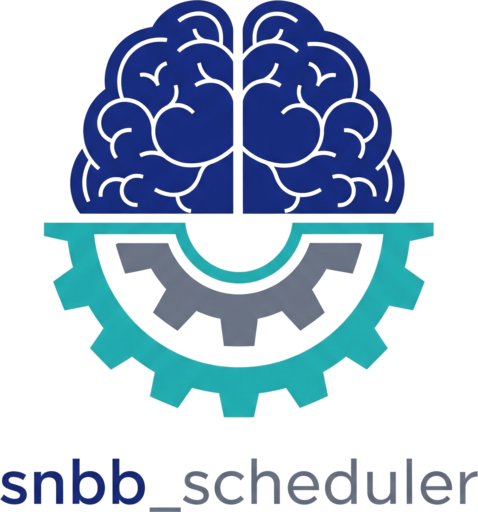

<p align="center">
  
</p>

# snbb-scheduler

A rule-based scheduler for the SNBB neuroimaging pipeline. Runs as a daily job: scans the filesystem, evaluates which processing steps are needed, and submits them to Slurm — automatically.

```
discover → evaluate → filter → submit → monitor
```

---

## What it does

`snbb-scheduler` watches a DICOM tree and a derivatives directory and continuously moves data through a pipeline of procedures:

1. **bids** — converts DICOMs to BIDS format via heudiconv
2. **bids_post** — derives DWI fieldmap EPI sidecars from the BIDS data
3. **defacing** — defaces T1w images for data sharing
4. **qsiprep** — DWI preprocessing via QSIPrep
5. **freesurfer** — structural reconstruction via FreeSurfer recon-all
6. **qsirecon** — tractography and connectivity via QSIRecon

Each procedure declares what it depends on. The scheduler respects those dependencies automatically, so `qsiprep` is never submitted before `bids_post` completes.

---

## Architecture

```
sessions.py   →   rules.py   →   manifest.py   →   submit.py
(DataFrame)       (Rule fns)     (task table)       (sbatch)
                                      ↑
                               audit.py / monitor.py
```

| Module | Responsibility |
|---|---|
| `sessions.py` | Walk `dicom_root` (or read a CSV) → DataFrame of sessions |
| `rules.py` | Evaluate which procedures need to run for each session |
| `manifest.py` | Build the pending task table, filter in-flight jobs |
| `submit.py` | Construct and call `sbatch` for each task |
| `monitor.py` | Poll `sacct` to update job statuses |
| `audit.py` | Append structured JSONL events for every state change |

---

## Quick start

```bash
# Install
git clone https://github.com/GalKepler/snbb_scheduler.git
cd snbb_scheduler
pip install -e ".[dev]"

# See what would be submitted (no real jobs)
snbb-scheduler --config /etc/snbb/config.yaml run --dry-run

# Submit real jobs
snbb-scheduler --config /etc/snbb/config.yaml run

# Check the queue
snbb-scheduler --config /etc/snbb/config.yaml status

# Show pending tasks
snbb-scheduler --config /etc/snbb/config.yaml manifest
```

---

## Design principles

- **Filesystem is the source of truth.** No database. Completion is determined by looking at actual output files.
- **Declarative rules.** Adding a procedure requires only a YAML entry — no code changes.
- **Conservative checks.** If in doubt, mark incomplete and re-run.
- **Safe by default.** `--dry-run` is always available. The scheduler never deletes data.
- **Idempotent.** Running twice in a row submits nothing if in-flight jobs are tracked.
